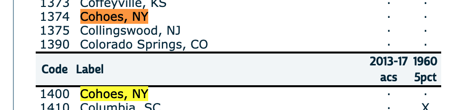

# ipumsr

R scripts for reading extracts from IPUMS.org

## Background

IPUMS.org is a phenomenal resource from the generous folks at the [Minnesota Population Center](https://www.pop.umn.edu/) that, among many other things, allows one to extra *unit-level responses* from the U.S. Census at [IPUMS USA](https://www.pop.umn.edu/).

## Getting the Data

IPUMS has a [helpful User Guide](https://usa.ipums.org/usa/doc.shtml), but the interface is intuitive. In either order, one [selects which surveys to query](https://usa.ipums.org/usa-action/samples)--say, the American Community Survey 5yr samples from 2014-2017--and then [selects variables](https://usa.ipums.org/usa-action/variables/group) from the hundreds of options. It's useful to choose the samples first, because then the search results for variables will indicate whether they're available in the samples you need.

*Important*: When you're ready to submit your extract, select SPSS as the data format, which deliver the data as a `.sav` file, which R can easily import. This format contains both the data and metadata for the variables, so it saves on the agony of harmonizing a flat file with a codebook.

You'll receive an email when you extract is ready. Download and unpack it somewhere that R can find it. It's good practice to also download the basic codebook for your extract, a small text file with a `.cbk` extension that contains all the information on your data request.

## Importing your data

The only dependency of `ipumsr` is `foreign`, which you need to install once (`install.packages('foreign`). This converts the SPSS `.sav` file to a data frame in R.

In your R script, you just need to import the library:

  source("ipumsr/ipums.R") #assuming you cloned the repo in the same directory
  
Then import your data:

  ipums_load("./data/usa_[EXTRACT NUMBER].sav")

Depending how much data you asked for, this can take several minutes. Time for a coffee break.

## Loading the data

You can import the data easily after loading this library:

  source("ipumsr/ipums.R")
  ipums <- ipums_load("./data/usa_00185.sav")
  data <- ipums

While it isn't required to duplicate the import into a second variable--`data`, in this case--I highly recommend it. There's a good chance you'll adulterate the data by accident, and this prevents you from having to reload the extract each time you start over. It's best to think of `ipums` as immutable.

### Common warnings, and why not to panic

When the data is loaded, there's a good chance you'll get a warning message like this:

  1: In read.spss(filepath, to.data.frame = TRUE) :
    Duplicated levels in factor CITY: Cohoes, NY, Lebanon, PA, North Providence, RI, San Angelo, TX, Vallejo, CA, Wilkinsburg, PA
  2: In read.spss(filepath, to.data.frame = TRUE) :
    Duplicated levels in factor BPLD: Br. Virgin Islands, ns

*Remain calm*. In the 181 extracts I've requested to date, this has never caused an actual problem. As far as I can tell, this most often happens with variables that are not present in the requested data. For example, while we do see two codes for "Cohoes, NY" in this extract from 2017 and 1960, neither are available:

And even if they were present, converting from a factor to a character string should resolve this.